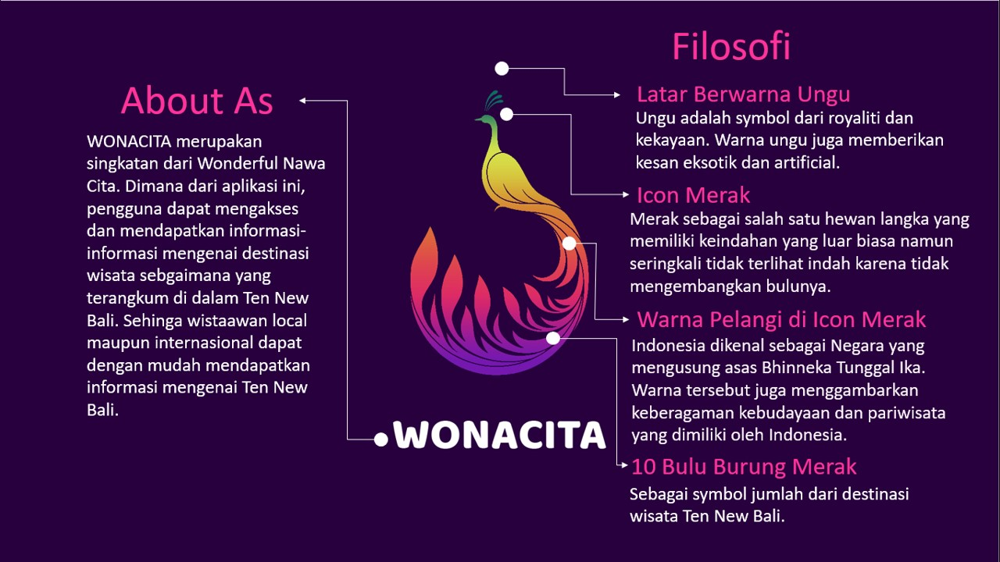
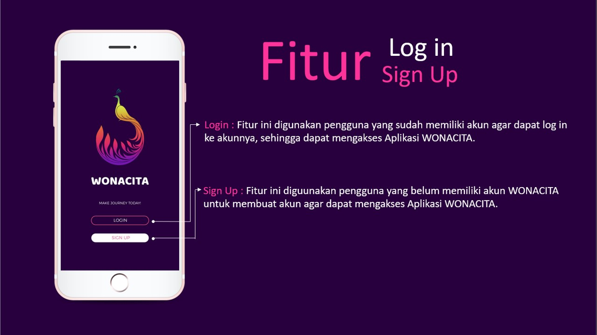
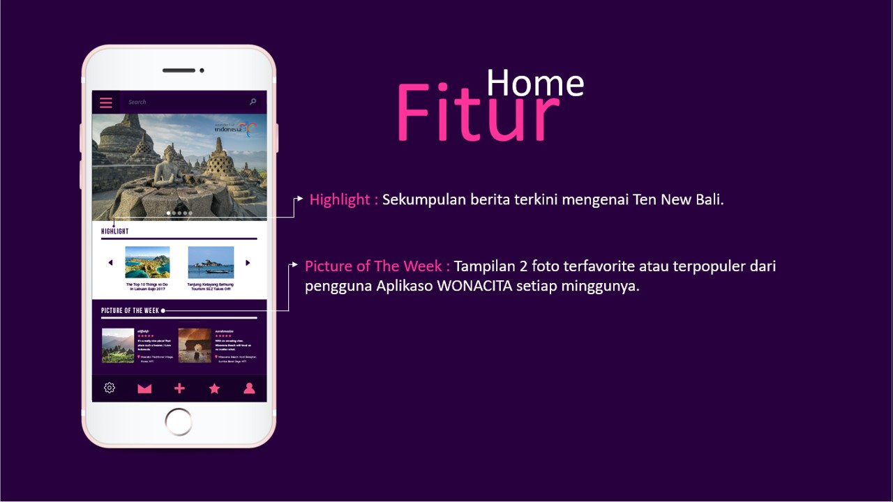
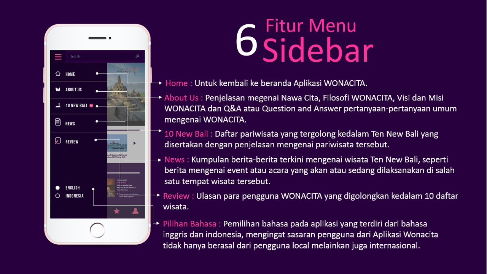
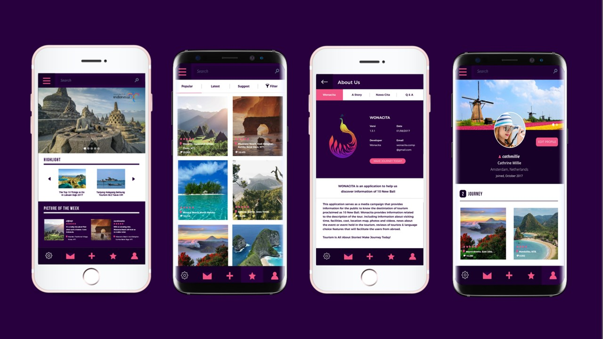

# RENTZ.ID

<!-- PROJECT LOGO -->
 

  

  <h3 align="center">Project "RENTZ.ID" Rent Product App </h3>

  

    Projek Capstone Pembangunan RESTful API Program Immersive Back End Batch 4
     
    <a href="https://github.com/alta-rentz/rentz-be"><strong>Kunjungi kami »</strong></a>
     
  

### 🛠 &nbsp;Build App & Database

&nbsp;
&nbsp;
&nbsp;
&nbsp;
&nbsp;
&nbsp;
&nbsp;
&nbsp;
&nbsp;
&nbsp;

<!-- ABOUT THE PROJECT -->
### 💻 &nbsp;About The Project

Wonacita merupakan aplikasi untuk mendukung program pemerintah "nawacita" yang berfokus pada sektor wisata dengan megusung 'Ten New Bali". adapun isi repo ini berupa sebuah RESTful API Rental App dengan menggunakan bahasa Golang. dilengkapi dengan berbagai fitur yang memungkinkan user untuk mengakses data yang ada didalam server. mulai dari membuat akun hingga upload photo dengan mencamtumkan caption.

      

<!-- IMAGES -->
### 🖼&nbsp;Images

Login

Home

Toolbar

Sidebar

  

Demo

<!-- CONTACT -->
### Contact

:copyright: 2021 | AAF

</h3>
